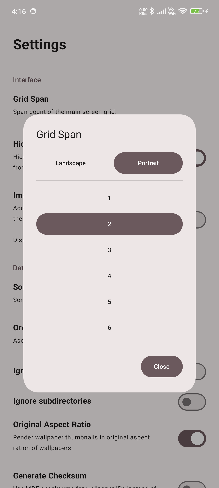
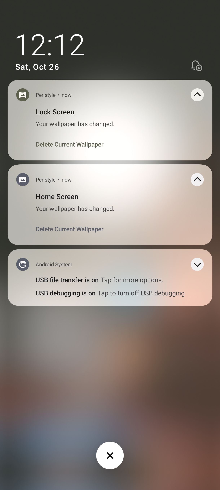
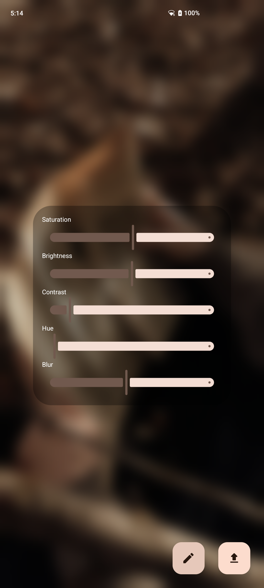
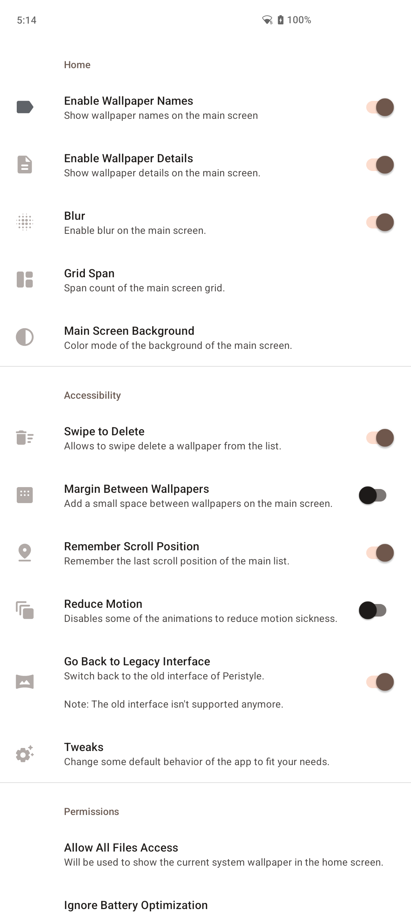
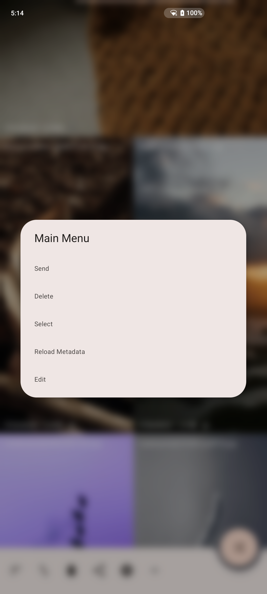

# Peristyle

Simple wallpaper manager app for Android.

## Why Peristyle?

Peristyle is created to be extremely simple and sophisticated wallpaper manager and browser app
for Android. It solves the problem of having too many features and bloated apps and having
very minimal support for locally stored wallpapers. What if you just wanted an app that allows
you to browse and select your own locally stored wallpapers and lets you manage and set wallpapers
from there? then Peristyle is for you :)

## Features

- Simple architecture, browse wallpapers and use system wallpaper manager to set them as wallpaper.
- Multiple folders support.
- Ability to assign Tags to any wallpaper.
- Can scan .nomedia directories, useful if you want to keep your wallpapers away from gallery.
- Apply blur and color filters dynamically on any wallpaper before applying.
- Simple yet pretty animations with proper optimizations.
- Compress or reduce images on the fly.
- No ads, no tracking, no analytics, no internet permissions, no unnecessary permissions.
- Auto wallpaper change support with dedicated folders and tags for each screens.
- Built-in live wallpaper picker.
- Dark mode support.
- Glassmorphic UI based on realtime blur effects and caustic shadows.
- Material You color theme.
- Fully reproducible build.
- Zero loading software architecture.

## Stats

[](https://hits.seeyoufarm.com)


## Download

[](https://github.com/Hamza417/Peristyle/releases/latest)
[](https://f-droid.org/en/packages/app.simple.peri/)
[](https://apt.izzysoft.de/fdroid/index/apk/app.simple.peri/)

## Screenshots

|  |  |  |
|:-----------------------------------------------------------------------:|:-----------------------------------------------------------------------:|:-----------------------------------------------------------------------:|
|  |  |  |
|  |  |  |
|  |  |  |

### Peristyle also has a totally different UI based on Material You

It can be toggled from the app settings.

|  |  |  |
|:----------------------------:|:----------------------------:|:----------------------------:|
|  |  |  |

## Triggering AutoWallpaperService from Other Apps

Peristyle supports triggering the AutoWallpaperService from other apps using the following
intent: `app.peristyle.START_AUTO_WALLPAPER_SERVICE`

**_You can use any automation or scheduling tool and create your own scenario to change wallpaper for any custom event such as locking/unlocking or as you need._**

## Permission Usage

Peristyle needs `MANAGE_EXTERNAL_STORAGE` and `READ_MEDIA_IMAGES` to be allowed to show the system
wallpapers in the app.
It has been discussed in
the [Issue #72](https://github.com/Hamza417/Peristyle/issues/72#issuecomment-2357558761).

The `REQUEST_IGNORE_BATTERY_OPTIMIZATIONS` is used to run Auto Wallpaper service whenever required.

And an access to all the wallpaper directories whichever the user specifies.

## v5.0.0 and Destructive Changes in the App
- **Removed MD5 for IDs, app will generate IDs from file location now.**
  - To make sure duplicate files are included.
- **Fixed empty screen when using predictive back gesture to peek the list.**
- **Migrated the whole app to [Files API](https://docs.oracle.com/javase/8/docs/api/?java/io/File.html). _(destructive change)_**
  - This will increase the performance of the app multifold and in my test I found the app to be loading data 10 to 50 times faster depending on the concurrency configuration and how much process that app running. Earlier, the app relied on [Scoped Storage](https://source.android.com/docs/core/storage/scoped) to fetch the wallpapers from the storage, which was severely limiting and extremely slow. The scoped storage takes more than 3–8 seconds to just traverse the list, and then processing the files is even slower. In the Files API which runs natively on the file system can traverse the whole internal storage in less than a second. **Yep, that fast!!**. If you felt the app loading really slow in the past or very sluggish performance, this was the reason, Google really did force it to be this way.
  - **Warning:** _This change is destructive, meaning the whole database structure of the app has changed and upon updating any of the previous app data will be lost and anything the app requires will be recreated with new IDs and structure. Your data can't be backed up and restored since the whole backend has changed. If the app data is important, don't update to this release._
- **Whole app loading framework is now utilizing the queue based concurrency.**
  - Earlier the app is utilizing the linear loading approach because of the Scoped Storage which made things even worse, it was already slow and loading the images one by one was a cherry on top. Since via Files API, it is possible to directly access the files, loading multiple of them at once. Although to prevent a system hazard, it's disabled by default and can be changed based on how many files you want to load at once from settings. I'm calling it **_highway toll plaza queue_** because it works something like that.
- **Added option to save your each effects and load them in real-time to any wallpaper in the app.**
  - All the effects will be saved as global effect parameters and can be previewed on any wallpaper being loaded in the app. The screen will show the currently opened wallpaper will all the effects applied on it in the list format, it's really cool and one of my coolest technical achievements so far. The effects can easily be applied in real-time with just a single tap, no loading no fuss everything is done dynamically. ([Screenshot](https://github.com/Hamza417/Peristyle/blob/master/fastlane/metadata/android/en-US/images/phoneScreenshots/11.png))
- **Added adjustment sliders to _Scale RGB_ channels in the _Effects_ dialog.**
  - Same as Hue, but controls the intensity of each color channels individually.
- **Huge improvements in the **Loader** framework, fixing a lot of data inconsistency issues.**
  - Rewrote the whole loader framework, removing a lot of garbage logic and fixed a lot of issues, simultaneously fixing a lot of data inconsistency in the app. I have also fixed a lot of mishandled orphan processes in the loader, overwhelming the data feeder from all sides.
- **Added a better real-time loading framework.**
  - All files will now be loaded in real-time and on app level, meaning any changes in the database will be reflected in the app live including folder count, wallpaper list and any other transactions.
- **Fixed files not deleting from notifications.**
- **Added option to recreate the database in the Settings.**
- **Fixed a few issues in Auto Wallpaper framework.**

**And, I did all of that in less than 24 hours. Enjoy!! 🎉🎉😄**

## Translate

[](https://crowdin.com/project/peristyle)

Peristyle supports localization, If you want to
translate Peristyle in your language/s, you can do
so [here on Crowdin](https://crowdin.com/project/peristyle).

### Translation Contributors

| Language              | Translators                                                                                                     |
|-----------------------|-----------------------------------------------------------------------------------------------------------------|
| Arabic                | [@eyadmahm0ud](https://crowdin.com/profile/eyadmahm0ud)                                                         |
| Chinese Simplified    | [@shanzhaxiaok](https://crowdin.com/profile/shanzhaxiaok) [@xjchenyang](https://crowdin.com/profile/xjchenyang) |
| Chinese Traditional   | [@aaypkzixad](https://crowdin.com/profile/aaypkzixad), [@hugoalh](https://crowdin.com/profile/hugoalh)          |
| French                | [@ppp987](https://crowdin.com/profile/ppp987)                                                                   |
| German                | [@ottozumkeller](https://crowdin.com/profile/ottozumkeller)                                                     |
| Italian               | [@gabrifrz](https://crowdin.com/profile/gabrifrz)                                                               |
| Polish                | [@Tama10](https://crowdin.com/profile/tama10), [@chefski](https://crowdin.com/profile/chefski)                  |
| Portuguese, Brazilian | [@teogabriel](https://crowdin.com/profile/teogabriel)                                                           |
| Spanish               | [@esneiderfjaimes](https://crowdin.com/profile/esneiderfjaimes)                                                 |
| Turkish               | [@mikropsoft](https://crowdin.com/profile/mikropsoft)                                                           |
| Vietnamese            | [@xeus0000](https://crowdin.com/profile/xeus0000)                                                               |

Last updated: 18 Sept, 2024

## License

```
Copyright 2023 Hamza Rizwan

Licensed under the Apache License, Version 2.0 (the "License");
you may not use this file except in compliance with the License.
You may obtain a copy of the License at

    http://www.apache.org/licenses/LICENSE-2.0

Unless required by applicable law or agreed to in writing, software
distributed under the License is distributed on an "AS IS" BASIS,
WITHOUT WARRANTIES OR CONDITIONS OF ANY KIND, either express or implied.
See the License for the specific language governing permissions and
limitations under the License.
```
