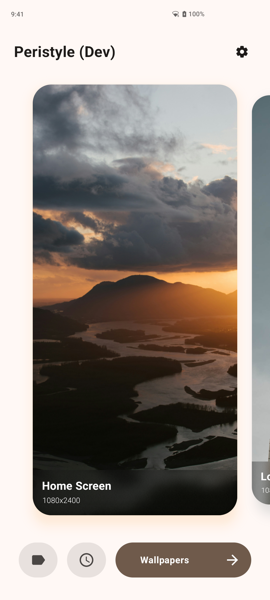
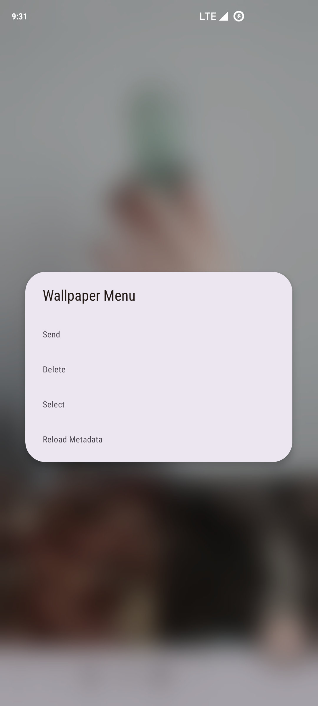
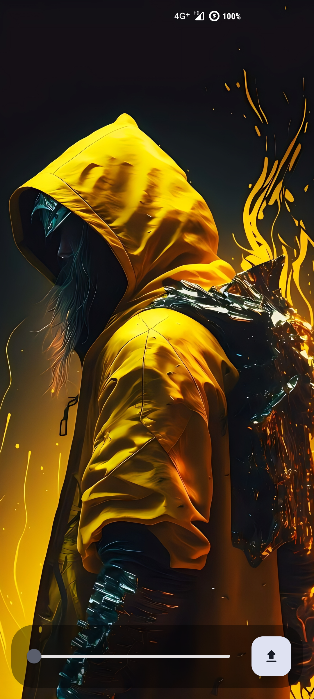
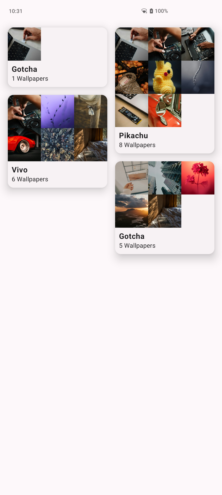
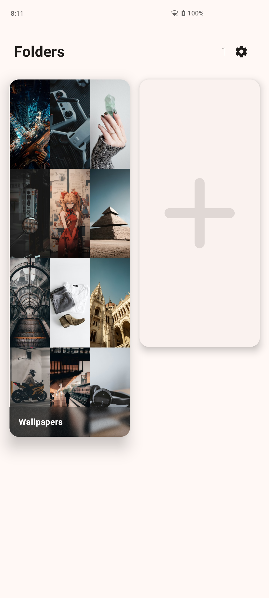
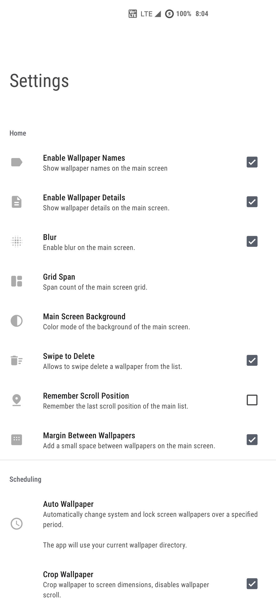
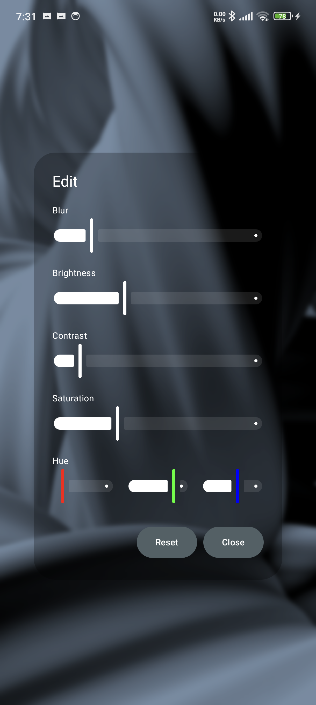
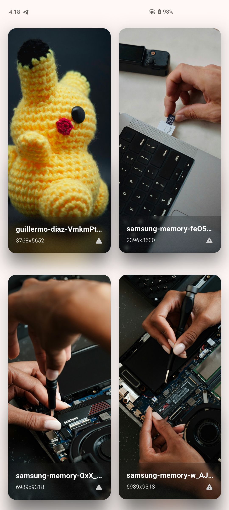
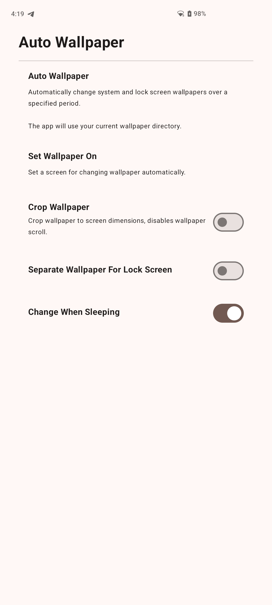

# Peristyle

Simple wallpaper manager app for Android built using Material libraries and design guidelines.

## Why Peristyle?

Peristyle is created to be extremely simple and sophisticated wallpaper manager and browser app
for Android. It solves the problem of having too many features and bloated apps and having
very minimal support for locally stored wallpapers. What if you just wanted an app that allows
you to browse and select your own locally stored wallpapers and lets you manage and set wallpapers
from there? then Peristyle is for you :)

## Features

- Simple architecture, browse wallpapers and use system wallpaper manager to set them as wallpaper.
- Can scan .nomedia directories, useful if you want to keep your wallpapers away from gallery.
- Apply blur and color filters dynamically on any wallpaper (Android 12 and up only).
- Auto wallpaper changer.
- Simple yet pretty animations with proper optimizations.
- Biometric lock support.
- Fully Material You design with Edge to Edge interface.

## Stats

[](https://hits.seeyoufarm.com)

[](https://t.me/peristyle_app)

## Download

[](https://github.com/Hamza417/Peristyle/releases/latest)
[](https://f-droid.org/en/packages/app.simple.peri/)
[](https://apt.izzysoft.de/fdroid/index/apk/app.simple.peri/)

## Screenshots

|      |      |      |
|      |      |      |
|      |      |      |

## Triggering AutoWallpaperService from Other Apps

Peristyle supports triggering the AutoWallpaperService from other apps using the following
intent: `app.peristyle.START_AUTO_WALLPAPER_SERVICE`

## Translate

[](https://crowdin.com/project/peristyle)

Peristyle supports localization, If you want to
translate Peristyle in your language/s, you can do
so [here on Crowdin](https://crowdin.com/project/peristyle).

### Translation Contributors

| Language           | Translators                                               |
|--------------------|-----------------------------------------------------------|
| Chinese Simplified | [@shanzhaxiaok](https://crowdin.com/profile/shanzhaxiaok) |
| French             | [@ppp987](https://crowdin.com/profile/ppp987)             |
| Polish             | [@Tama10](https://crowdin.com/profile/tama10)             |
| Turkish            | [@mikropsoft](https://crowdin.com/profile/mikropsoft)     |
| Vietnamese         | [@xeus0000](https://crowdin.com/profile/xeus0000)         |

## License

```
Copyright 2023 Hamza Rizwan

Licensed under the Apache License, Version 2.0 (the "License");
you may not use this file except in compliance with the License.
You may obtain a copy of the License at

    http://www.apache.org/licenses/LICENSE-2.0

Unless required by applicable law or agreed to in writing, software
distributed under the License is distributed on an "AS IS" BASIS,
WITHOUT WARRANTIES OR CONDITIONS OF ANY KIND, either express or implied.
See the License for the specific language governing permissions and
limitations under the License.
```
