# Peristyle

Simple wallpaper manager app for Android.

## Why Peristyle?

Peristyle is created to be an extremely simple and sophisticated wallpaper manager and browser app for Android. It solves the problem of bloated apps with too many features which have very minimal support for locally stored wallpapers. You just wanted an app that allows you to browse, select, manage, and set your own locally stored wallpapers? Then Peristyle is for you :)

## Features

- Simple architecture. Browse images and use the system wallpaper manager to set them as wallpapers.
- Multiple folders support.
- Ability to assign Tags to any wallpaper.
- Can scan .nomedia directories. Useful if you want to keep your wallpapers out of your gallery.
- Apply blur and color filters dynamically on any wallpaper before applying.
- Simple yet pretty animations with proper optimizations.
- Compress or reduce images on the fly.
- No ads, no tracking, no analytics, no internet permissions, no unnecessary permissions.
- Auto wallpaper change support with dedicated folders and tags for each screen.
- Change wallpaper using app's live wallpaper
- Edit and apply filters on wallpapers losslessly in realtime.
- Built-in live wallpaper picker.
- Built-in Wallhaven client for browsing and downloading wallpapers from the internet.
- Dark mode support.
- Glassmorphic UI based on realtime blur effects and caustic shadows.
- Material You color theme.
- Fully reproducible build.
- Zero loading software architecture.

## Stats


## Download

[](https://github.com/Hamza417/Peristyle/releases/latest)
[](https://f-droid.org/en/packages/app.simple.peri/)
[](https://apt.izzysoft.de/fdroid/index/apk/app.simple.peri/)

## Screenshots

| 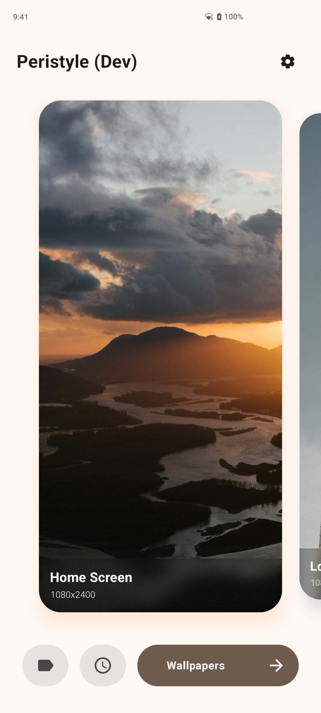 | 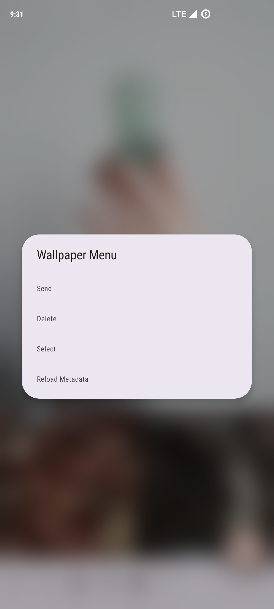 | 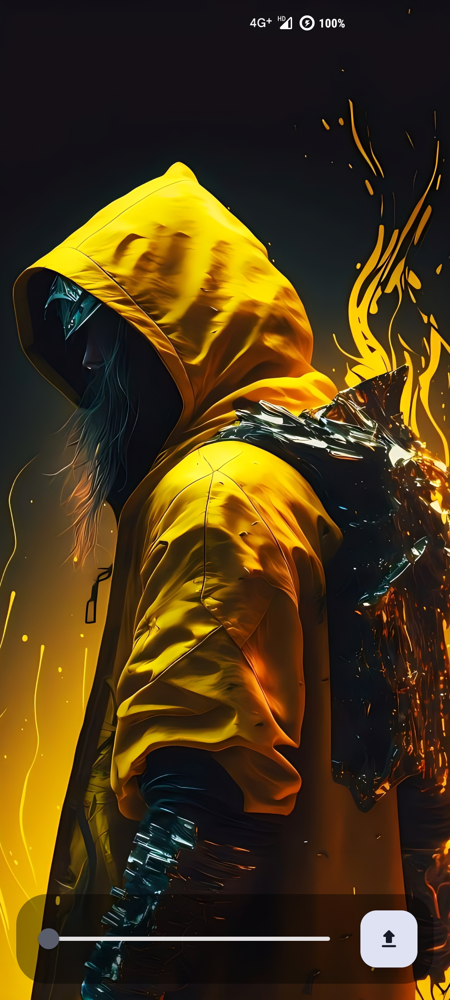 |
|:-----------------------------------------------------------------------:|:-----------------------------------------------------------------------:|:-----------------------------------------------------------------------:|
| 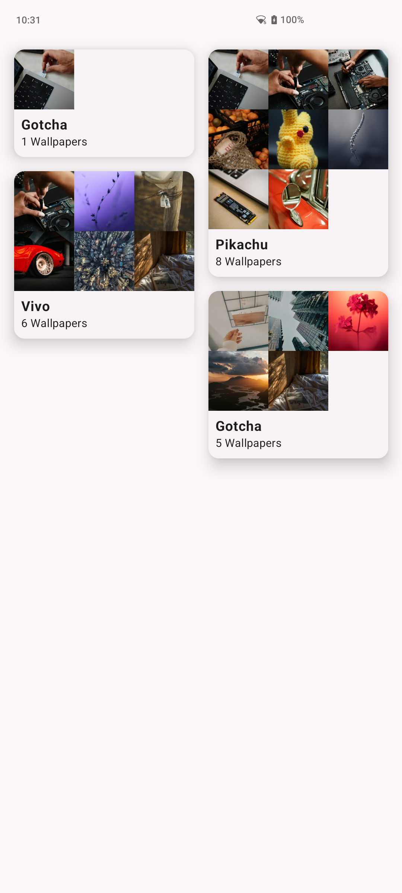 | 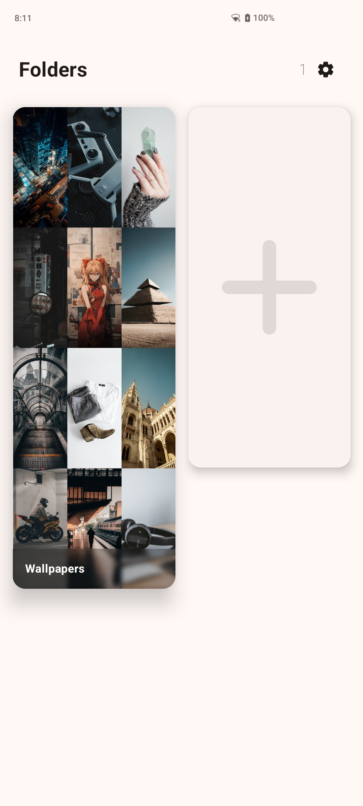 | 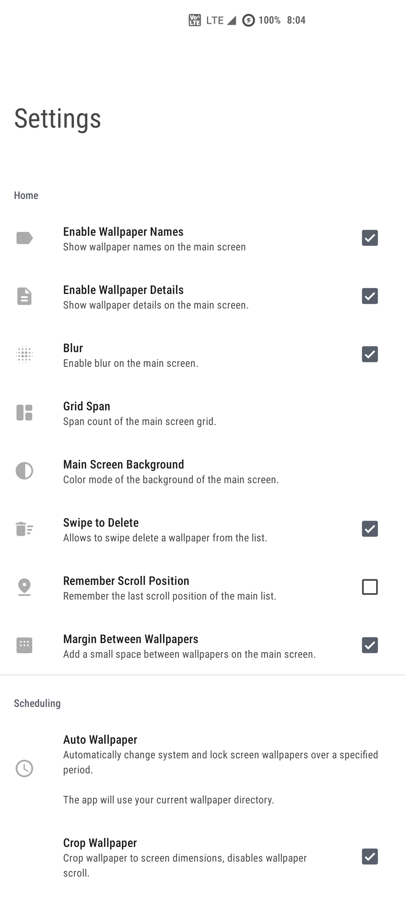 |
| 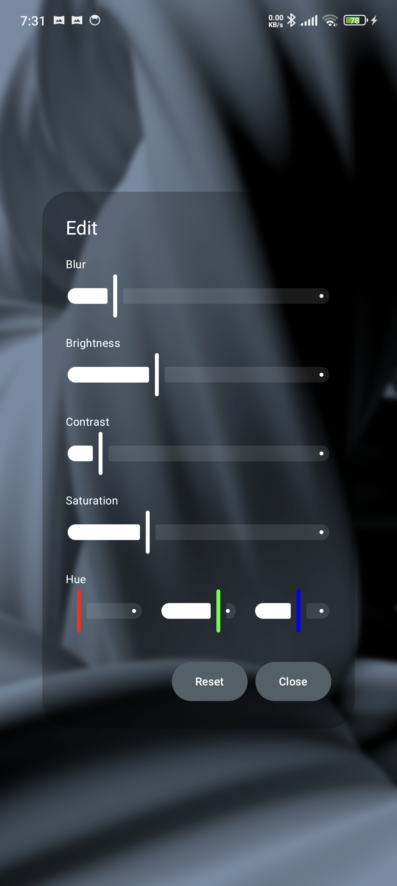 | 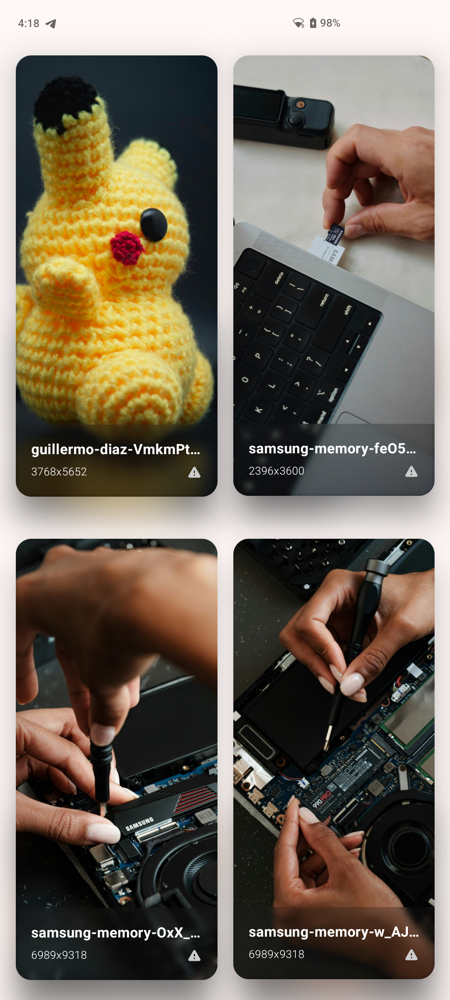 | 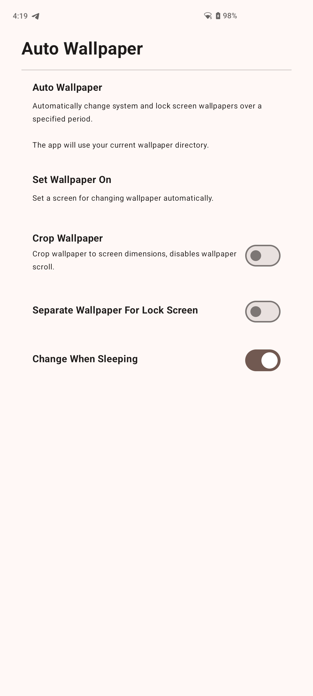 |
|  | 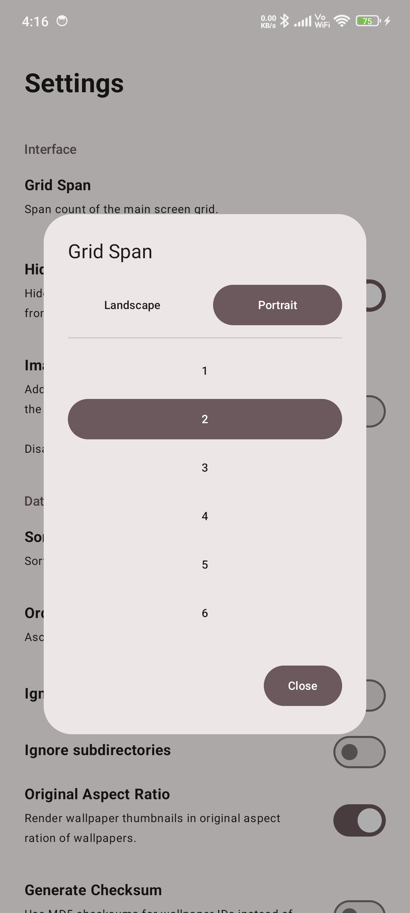 | 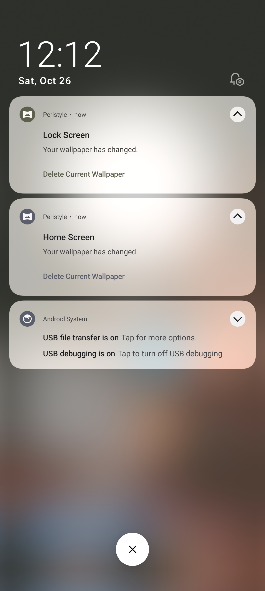 |

## Triggering AutoWallpaperService externally

Peristyle supports triggering the AutoWallpaperService externally using the following intent: `app.peristyle.START_AUTO_WALLPAPER_SERVICE`

**_You can use any automation or scheduling tool and create your own scenarios to change the wallpaper for any custom event such as locking, unlocking, etc._**

## Permission Usage

Peristyle needs `MANAGE_EXTERNAL_STORAGE` and `READ_MEDIA_IMAGES` to be allowed to show the system wallpapers in the app.
This has been discussed in [Issue #72](https://github.com/Hamza417/Peristyle/issues/72#issuecomment-2357558761).

The `REQUEST_IGNORE_BATTERY_OPTIMIZATIONS` permission is used to run the AutoWallpaperService whenever required.

Additionally requires access to any wallpaper directories the user specifies.

## Translate

[](https://crowdin.com/project/peristyle)

Peristyle supports localization. If you want to translate Peristyle into your own language(s), you can do so [here on Crowdin](https://crowdin.com/project/peristyle).

[Contributors](https://crowdin.com/project/peristyle/members)

## License

```
Copyright 2023 Hamza Rizwan

Licensed under the Apache License, Version 2.0 (the "License");
you may not use this file except in compliance with the License.
You may obtain a copy of the License at

    http://www.apache.org/licenses/LICENSE-2.0

Unless required by applicable law or agreed to in writing, software
distributed under the License is distributed on an "AS IS" BASIS,
WITHOUT WARRANTIES OR CONDITIONS OF ANY KIND, either express or implied.
See the License for the specific language governing permissions and
limitations under the License.
```
